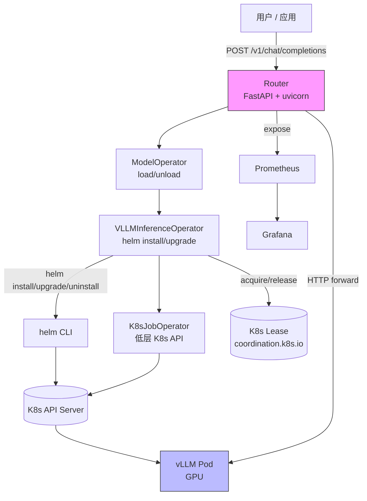

# AMD ROCm 岗面试准备 — 设计稿

**日期**：2026-06-24
**状态**：待审阅
**目标**：为 AMD ROCm Python 后端岗面试准备两套简历（通用 + 路线专用）+ k8s-llm-runtime 项目的 1-pager / 5min pitch / 白板 Q&A / 架构图，共 8 个产出文件 + 1 个 spec。

> **范围**：本 spec 覆盖"从已有学习材料到可投岗、可面试"的完整产出物。**k8s-llm-runtime 仓库本身不修改**——它是面试项目的代码载体，本 spec 围绕"如何呈现"它。

---

## 背景与目标

### 起源

学习仓库 learning-journey 下已沉淀两条完整学习路线的产出物：

- **brain-computer-interface 路线**（已学完）：含 BCI 软件项目、PyQt GUI、CNN 解码器；现有 `notes/resume.md` (7.7KB) + `resume.pdf` (130KB) + `interview-prep-plan.md` (9.3KB) + `interview-prep.md` (6.4KB)
- **amd-rocm-python-backend 路线**（进行中）：含 k8s-llm-runtime 完整项目（31 commits, v0.1.0 tagged）；但 notes/ 下只有 `job-requirements.md`（3KB），**没有简历、没有面试弹药**

通用 `notes/Resume.md`（59 行）当前状态：
- 求职意向未写
- 项目经验只 3 个：Snakemake 框架、Linux 系统维护、PyTorch
- 技能栏无 Docker / k8s / Helm / FastAPI / Prometheus
- 无 BCI 项目、无 k8s-llm-runtime 项目

### 目标

补齐"投 AMD ROCm Python 后端岗"所需的全部产出物：

1. **两套简历**：通用简历（多向）+ amd-rocm 路线专用简历（单向上深度）
2. **项目展示**：k8s-llm-runtime 项目 1-pager + 5min pitch + 白板 Q&A + 架构图
3. **可立即投岗**：PDF 导出，链接可挂

### 适配 JD 关键需求

参考 `tracks/amd-rocm-python-backend/notes/job-requirements.md`：

| JD 要求 | 本 spec 对应物 |
|---|---|
| Python 后端 2 年+ | 通用 Resume.md 强化 Python / 异步 / FastAPI 技能栏 |
| Docker / k8s / Helm 部署 | amd-rocm 简历突出 K8s 抽象 / Helm chart / ConfigMap 注入 |
| 容器化、任务编排、集群运维 | k8s-llm-runtime 1-pager 第 2、3 亮点 |
| AMD ROCm 加分 | amd-rocm 简历强化 ROCm / vLLM 关键词；Q&A 5 题 |
| 大模型推理 Workshop | 5min pitch（向面试官讲项目的口径） |

---

## 关键决策汇总

| 维度 | 决策 | 理由 |
|---|---|---|
| 简历版本策略 | **两套：通用 + amd-rocm 专用** | 通用应对多向投递；专用按 JD 定制 |
| 通用 Resume.md 变化 | 加 2 个项目卡片（k8s-llm-runtime 主力 + BCI 轻提） | 用户已学完 BCI，应反映在通用简历 |
| amd-rocm 专用 | **完全新建，按 JD 定制**（沿用 BCI `resume.md` 模板结构） | JD 硬性要求 K8s 实战 + 大模型项目 + 容器化；缺口分析点名 Snakemake 类 Argo Workflows；面试需现场跑 demo |
| 定制依据 | `notes/job-requirements.md`（56 行）—— 5 项硬性 + 9 项加分 + 缺口优先级 | 用户明确要求"按招聘要求定制" |
| 1-pager 风格 | **技术架构型**（4 大亮点） | 适配技术面试（非量化型 / 非踩坑型） |
| **执行节奏** | **分两阶段：① 简历先行 → ② 面试弹药** | 用户明确"先弄好简历其他的再说" |
| 博客 | **不在本 spec 范围**（v0.2.0 可选） | 1-pager 是博客的素材源；v0.2.0 再扩写 |
| 架构图格式 | Mermaid（.mmd） | GitHub/VSCode/1-pager 内联渲染 |
| PDF 导出工具 | weasyprint（BCI 已用）| 复用 BCI `resume.css` 样式 |

---

## 文件清单（8 个产出 + 1 个 spec）

```
/work/run/projects/bio-24/my_projects/learning-journey/
├── notes/
│   └── Resume.md                                          # ① 修改（+2 卡片）
├── tracks/amd-rocm-python-backend/
│   └── notes/
│       ├── job-requirements.md                            # 已有（不修改）
│       ├── resume.md                                      # ② 新建
│       ├── resume.css                                     # ③ 新建（从 BCI 复制）
│       ├── resume.pdf                                     # ④ 新建（weasyprint 导出）
│       └── k8s-llm-runtime/
│           ├── 1-pager.md                                 # ⑤ 新建
│           ├── 5min-pitch.md                              # ⑥ 新建
│           ├── whiteboard-qa.md                           # ⑦ 新建
│           └── architecture.mmd                           # ⑧ 新建
└── docs/superpowers/specs/
    └── 2026-06-24-amd-interview-prep-design.md            # 本文档
```

---

## ① 通用 Resume.md 修改

### 修改前状态
- 项目经验 3 个：Snakemake、Linux 维护、PyTorch
- 求职意向未写
- 技能：C/C++/VB/R/Python/Matlab/SAS + Linux/PyTorch/Office

### 修改后状态
- 求职意向新增 1 行：`**求职意向**：Python 后端 / K8s / 生信工程`
- 项目经验 5 个：保留 3 + 新增 2
- 技能栏扩展

### 新增项目卡片 1：k8s-llm-runtime（6-8 行）

```markdown
### k8s-llm-runtime：OpenAI 兼容的 K8s vLLM 模型服务网关

- **背景**：vLLM 模型部署需 GPU + 容器 + 路由，团队多人共享时模型管理复杂
- **设计**：用 Helm chart + Python lib 抽象，让"加载/卸载模型"成为一行命令
- **实现**：双 chart（llm-inference + llm-router）+ lib 三层（K8sJobOperator / VLLMInferenceOperator / ModelOperator）
- **关键决策**：K8s Lease 分布式锁防 Router 多副本并发部署；ConfigMap 注入 aliases 避免镜像 rebuild
- **可观测性**：Prometheus 业务级 metrics（`chat_completions_duration_seconds` 等）+ structlog JSON 日志
- **质量**：31 commits / 90 tests pass / coverage 88% / ruff + mypy strict + helm-lint clean
- **仓库**：[github.com/.../k8s-llm-runtime](https://...)  ·  v0.1.0 tagged
```

### 新增项目卡片 2：BCI 软件项目（3-4 行）

```markdown
### 脑机接口实时信号处理与解码软件

- 6 周学习路线产出：PyQt 实时 GUI + CNN 时空解码器（PyTorch，可选）
- 模块化信号处理 pipeline（滤波 / ICA / 时频），服务端 FastAPI 暴露
- 详见 `tracks/brain-computer-interface/notes/resume.md`
```

### 技能栏扩展

新增项：**容器 / 平台**：Docker, k8s, Helm, Prometheus, Grafana · **Web 后端**：FastAPI, Pydantic, async/await, httpx

### 验证
- 通用 Resume.md 长度 ≤ 1.5 页
- 求职意向首屏可见
- 5 个项目倒序（k8s-llm-runtime 最新在最上）

---

## ② amd-rocm 专用 resume.md（按 JD 定制新建）

### 定制依据（对照 `notes/job-requirements.md`）

| JD 项 | 简历对应 | 强化点 |
|---|---|---|
| 🔴 硬性：Python 后端 2 年+ | 工作经历 + 技能栏 | 突出 3 年 Python + FastAPI 异步（不只 Django） |
| 🔴 硬性：Docker/k8s 部署 | 技能栏 + k8s-llm-runtime 项目 | 强调 "独立部署 Python Web 到 K8s" 水平 |
| 🔴 加分：AI/GPU 项目 | k8s-llm-runtime 项目 | 强调 vLLM + OpenAI 兼容 + Helm chart 部署 |
| 🔴 加分：ML 平台 | Snakemake 框架 | 强调"类 Argo Workflows"——JD 自己点的类比 |
| 🟡 加分：GPU 集群 | k8s-llm-runtime | 强调 GPU vendor 切换（amd/nvidia/none） |
| 🟡 加分：Python 后端强化 | 技能栏 | 突出 FastAPI + async + Pydantic + httpx |
| 🟢 加分：前端基础 | 不强提 | 简历不写（JD 优先级最低） |
| 🟢 加分：数据库/中间件 | 不强提 | 简历不写（Week 3 后续补） |
| 现场 demo | 个人优势 + 项目结尾 | "自带电脑可现场跑 kind cluster + LLM demo" |
| 汇报线 | 不写 | 不写 Vincent Fang（避免太针对性） |

### 整体策略
完全沿用 BCI `resume.md` 结构（7.7KB 模板已成熟），但内容替换为 AMD ROCm Python 后端工程师方向。

### 结构
```markdown
# 胡盛

- 电话：188-5665-3017
- 邮箱：hs3434@foxmail.com
- 个人网站：hs3434.github.io
- 求职意向：**AMD ROCm Python 后端开发工程师**（ROCm Radeon Cloud 方向）

---

## 个人简介

3 年生物信息工程化经验，自学转型 K8s 后端栈。
专注**容器化部署、资源调度、任务编排、GPU 推理服务**。
最近 6 周自学 ROCm / K8s / Helm / FastAPI / Prometheus，独立完成 **k8s-llm-runtime**（K8s 上的 vLLM 模型服务网关），**v0.1.0 tagged，可现场跑 demo**。
熟悉 Snakemake 类 Argo Workflows 的 ML 平台抽象。

---

## 求职技能（按岗位匹配排序，4 层）

### 后端核心（硬性 1）
- Python 3.11+（asyncio, type hints, Pydantic, httpx async）
- FastAPI（OpenAPI / dependency injection / lifespan）
- 测试：pytest, pytest-asyncio, 88% coverage

### 容器与编排（硬性 2）
- Docker（multi-stage 构建，Alpine 镜像优化）
- Kubernetes（Pod / Service / Deployment / StatefulSet / ConfigMap / RBAC）
- Helm chart（values 模板化，helm install/upgrade/uninstall，CI lint clean）
- 镜像仓库：registry.k8s.io / docker.io / ghcr.io / nvcr.io（国内 DaoCloud 镜像加速）

### GPU / LLM 生态（加分 1）
- vLLM（OpenAI 兼容 API，推理服务）
- AMD ROCm 基础（HSA / HIP 概念，amd.com/gpu 资源调度）
- PyTorch（CNN 时空解码器 / Transformer）
- Hugging Face（transformers 库，tokenizer）

### 可观测性与工具链
- Prometheus（prometheus_client，histogram / counter / gauge）
- structlog（JSON structured logging）
- uv / ruff / mypy strict / GitHub Actions
- Linux 服务端运维（systemd, Nginx, 端口/进程管理）

---

## 项目经验

### k8s-llm-runtime：K8s 上的 vLLM 模型服务网关（v0.1.0 tagged）

[深度展开 12-16 行，强调 4 大技术亮点 + GPU 关键词 + demo ready，见下方子节]

### 基于 Snakemake 的 ML 平台工作流框架（生信背景，类 Argo Workflows）

- 背景：Snakemake rule 语法无法实现模块随意组合
- 设计：摈弃 rule 语法，直接调内部接口动态生成 rule，规范输入输出类型即可积木式拼接
- 关联：JD 加分项"机器学习平台研发经验"——本项目是 ML 平台抽象的工程实践

### 脑机接口 CNN 解码器（PyTorch）—— 6 周学习路线产出

- 端到端时空卷积解码 EEG 信号
- PyQt 实时 GUI + FastAPI 暴露
- 详见 BCI 专用简历 `tracks/brain-computer-interface/notes/resume.md`

---

## 工作经历

### 上海尤里卡信息科技有限公司 ｜ 生物信息工程师 ｜ 2025.04 - 至今
- **Docker 部署**：业务代码 Docker 化（基于 snakemake + 自研框架）
- **服务端运维**：Linux 服务器日常维护，Nginx 反向代理，systemd 服务管理
- **云平台工具开发**：业务自动化流程 + 算法工具

### 上海欧易生物医学科技有限公司 ｜ 生物信息研发工程师 ｜ 2022.08 - 2024.07
- **云平台生信工具开发**：R / Python / Linux / Docker / 云原生
- **业务自动化**：医学转录组业务流程自动化，模块化、可复用
- **平台地址**：[cloud.oebiotech.com](https://cloud.oebiotech.com/#/home)

---

## 教育背景

**西北农林科技大学** ｜ 植物科学与技术专业 ｜ 本科 ｜ 2018.09 - 2022.07

- 毕业论文：基于逻辑斯蒂回归的小麦倒伏相关性状分析
- 大创项目：根瘤菌接种对紫花苜蓿抗铜污染的影响（参与作者）

---

## 个人优势

- **6 周自学 K8s 后端栈**：从零到 v0.1.0 tagged 项目，独立完成双 Helm chart + Python lib
- **现场 demo 能力**：可自带电脑在 kind cluster 上跑通完整 LLM 推理流程（部署 → 路由 → chat completions → metrics）
- **学习能力强**：3 年内从生物信息跨界到 K8s 后端，技术热情高
- **3 年 Python 工程化经验**：从科研脚本到云平台工具的完整路径
```

### 关键内容：k8s-llm-runtime 深度展开（按 JD 关键词强化）

```markdown
**问题**（对应 JD 职责 1 + 3）：vLLM 模型部署需 GPU + 容器 + 路由，
团队多人共享时模型管理复杂；研究/小团队想用 OpenAI 兼容 API 时门槛高。
（直接对应 JD："大模型训练/推理 Workshop、教程、功能演示"）

**架构**（双 chart + 三层 lib + 镜像优化）：
- `charts/llm-inference/`：vLLM 负载 chart，**GPU vendor 切换仅靠 `values.yaml`**
  （amd.com/gpu / nvidia.com/gpu / none 三态，values 显式选择）
- `charts/llm-router/`：FastAPI 网关 chart
  - ConfigMap 注入 initContainer 加载兄弟 chart
  - RBAC 最小权限（Pod/Service/ConfigMap read+write + Lease）
  - ServiceMonitor 可选启用（Service 0.0.0.0:9090/metrics）
- `src/k8s_llm_runtime/`：3 层 lib 抽象
  - `K8sJobOperator`（低层，通用 Job 调度）
  - `VLLMInferenceOperator`（中层，helm CLI subprocess + GPU vendor）
  - `ModelOperator`（高层，OpenAI 兼容 + 自动部署）

**4 大技术亮点**：
1. **lib 三层分层抽象**（对应 JD 后端架构能力）
   - 上层 ModelOperator 只关心 load_model(alias) / unload_model(alias)
   - 中层 VLLMInferenceOperator 封装 helm 细节
   - 低层 K8sJobOperator 通用 K8s Job 调度
2. **Helm ConfigMap 注入 aliases**（对应 JD 容器化 + 资源调度）
   - 避免每次新增模型都 rebuild 镜像（GPU 镜像 15-20GB rebuild 5-10min）
   - ConfigMap 秒级生效，零镜像重建
3. **K8s Lease 分布式锁**（对应 JD 集群运维 + HA）
   - coordination.k8s.io/v1 Lease 防止 Router 多副本并发部署同一模型
   - 锁粒度按 model alias，自动过期 + 续约
4. **业务级 Prometheus metrics**（对应 JD 平台可观测性）
   - `chat_completions_duration_seconds`（histogram，含 status code 标签）
   - `http_requests_total`（counter，按 method/route/status）
   - `models_loaded`（gauge，反映 in-memory state）
   - ServiceMonitor 可选进 Grafana

**GPU vendor 切换 demo**（对应 JD 加分 GPU 集群）：
- values.yaml `gpu.vendor=amd|nvidia|none`
- AMD：amd.com/gpu 资源调度，ROCm vLLM 镜像
- NVIDIA：nvidia.com/gpu 资源调度，CUDA vLLM 镜像
- none：CPU only 模式（kind cluster 默认）

**质量保证**：
- 31 commits / 90 tests pass / coverage 88%
- ruff + mypy strict + helm-lint 全 clean
- 2 Helm charts（llm-inference + llm-router）

**踩坑与修复**：
- Service DNS 不匹配 bug：`--set fullnameOverride={release_name}` 修复
- kind 节点国内镜像加速：containerdConfigPatches + DaoCloud mirror
- 这些都写入 `docs/amd-interview-demo.md` 供现场参考

**未来**（v1.1）：SSE 流式推理 / RBAC 收紧只读 / 真实 GPU 集群 e2e
```

### 验证
- amd-rocm 专用 resume.md 长度 2-3 页（**长度无限制**，重点是关键词命中）
- 求职意向 / 个人简介 / 技能栏三段都是"AMD ROCm 关键词强相关"
- k8s-llm-runtime 占用 ≥ 1/3 篇幅
- 关键词命中（grep 自检）：AMD ROCm / vLLM / Helm / K8s / Prometheus / 容器化 / 资源调度 / Snakemake / 类 Argo Workflows / 现场 demo 至少各 ≥ 1
- "现场 demo 能力" 显式写进个人优势

---

## ③ ④ resume.css + resume.pdf

### resume.css
- **来源**：从 `tracks/brain-computer-interface/notes/resume.css`（1KB）复制
- **修改**：不修改（样式通用，简历内容差异由 .md 决定）

### resume.pdf
- **工具**：weasyprint（apt 装过；如未装则用 wkhtmltopdf 替代）
- **命令**：
  ```bash
  cd tracks/amd-rocm-python-backend/notes
  weasyprint resume.md resume.pdf --stylesheet resume.css
  ```
- **导出后验证**：PDF 1.5-2 页，求职意向首屏可见，技能表格渲染正确

---

## ⑤ k8s-llm-runtime/1-pager.md（技术架构型）

### 结构（1.5 页内，按 JD 关键词强化）

```markdown
# k8s-llm-runtime
## OpenAI 兼容的 K8s vLLM 模型服务网关（v0.1.0 tagged）

> 1 行定位：用 Helm + Python lib 把 vLLM 模型部署变成一行命令，自动暴露 OpenAI 兼容 API。
> 对应 JD：大模型推理 Workshop / 平台型软件后端研发 / 容器化部署 / 资源调度 / 任务编排

## 问题

vLLM 模型部署需要 GPU + 容器 + 路由，团队多人共享时模型管理复杂；
研究/小团队想用 OpenAI 兼容 API 时门槛高，每次新模型都要重写 K8s manifest。

## 架构（一张 Mermaid 图）

[内联 `architecture.mmd` 内容]

## 4 大技术亮点

### 1. lib 三层分层抽象
- `K8sJobOperator`（最底）：通用 K8s Job 调度
- `VLLMInferenceOperator`（中）：封装 helm install/upgrade/uninstall + GPU vendor 切换
- `ModelOperator`（高）：用户只调 `load_model(alias)` / `unload_model(alias)`，底层细节全封装
- 对应 JD：平台型软件后端研发 / 任务编排

### 2. Helm ConfigMap 注入 aliases
- vLLM 镜像内已有 `aliases.json` 模板，**只需 ConfigMap 注入**而非 rebuild 镜像
- initContainer 把 chart 源从 ConfigMap cp 到 `/app/charts/llm-inference/`
- 新增模型仅改 ConfigMap，零镜像重建（GPU 镜像 15-20GB，rebuild 5-10min）
- 对应 JD：容器化部署 / 资源调度

### 3. K8s Lease 分布式锁
- 用 `coordination.k8s.io/v1` Lease 防 Router 多副本并发部署同一模型
- 锁粒度按 model alias，自动过期 + 续约
- 对应 JD：集群运维 / HA 设计

### 4. 业务级 Prometheus metrics
- `chat_completions_duration_seconds`（histogram，含 status code 标签）
- `http_requests_total`（counter，按 method/route/status）
- `models_loaded`（gauge，反映 in-memory state）
- ServiceMonitor 可选启用
- 对应 JD：数据集管理 / 平台可观测性

## GPU vendor 切换（对应 JD 加分 GPU 集群）

- values.yaml `gpu.vendor=amd|nvidia|none`
- AMD：amd.com/gpu 资源调度，ROCm vLLM 镜像
- NVIDIA：nvidia.com/gpu 资源调度，CUDA vLLM 镜像
- none：CPU only 模式（kind cluster 默认，本地开发用）

## 量化指标

| 维度 | 数值 |
|---|---|
| Commits | 31 |
| Tests | 90 pass |
| Coverage | 88% |
| Lint | ruff + mypy strict + helm-lint 全 clean |
| Helm charts | 2（llm-inference + llm-router） |
| Demo | kind cluster + LLM 推理端到端可跑 |

## 未来工作

- v1.1：SSE 流式推理（`ChatRequest.stream` 字段已预留）
- v1.1：RBAC 收紧只读 services
- v1.1：真实 GPU 集群 e2e（M3 MacBook 无 GPU，仅 CI kind 跑过）
```

---

## ⑥ k8s-llm-runtime/5min-pitch.md

### 结构（5 段，每段标注时长，对应 JD 关键词 + 现场 demo 引导）

```markdown
# 5 分钟面试讲解稿 — k8s-llm-runtime

> 配套：`docs/amd-interview-demo.md`（现场 demo 命令清单）
> 对应岗位：AMD ROCm Python 后端开发工程师

## 0:00 - 0:30  开场（30 秒）

> "我是胡盛，3 年生物信息工程化经验，最近 6 周自学 K8s 后端栈，
> 完成 k8s-llm-runtime —— 一个在 K8s 上把 vLLM 模型部署变成一行命令的项目，
> 暴露 OpenAI 兼容 API。v0.1.0 已 tag，可现场跑 demo。
> 今天用 5 分钟讲一下设计 + 4 个技术亮点 + 1 个踩坑。"

## 0:30 - 2:00  问题陈述（90 秒，对应 JD 职责）

- vLLM 模型部署需要 GPU + 容器 + Service 路由 + 配置管理
- 团队多人共享 GPU 资源时：谁部署了哪个模型、版本多少、怎么下线？
- 现有方案（裸 YAML / KServe）门槛高或者引入 CRD 复杂度
- 目标：用户发 `POST /v1/chat/completions`，网关在后台按需 `helm install` 部署对应模型，部署完成后自动转发
- 对应 JD 职责："大模型训练/推理 Workshop / 教程 / 功能演示" + "平台型软件后端研发"

## 2:00 - 4:00  架构 + 4 大亮点（120 秒，对应 JD 硬性 + 加分）

**架构**（30 秒）：双 chart（llm-inference + llm-router）+ 三层 Python lib
- llm-inference：vLLM 负载 chart，GPU vendor 切换仅靠 `values.yaml`（amd/nvidia/none）
- llm-router：FastAPI 网关 chart，ConfigMap 注入 initContainer 加载兄弟 chart

**4 大亮点**（90 秒，每点 ~22 秒）：
1. **分层抽象**（对应 JD 后端架构）— ModelOperator 只关心 load/unload，Helm 细节全封装
2. **ConfigMap 注入 aliases**（对应 JD 容器化）— 新模型不改镜像（15-20GB 镜像 rebuild 5-10min），仅改 ConfigMap
3. **K8s Lease 锁**（对应 JD 集群运维）— Router 多副本防并发部署同模型
4. **业务级 metrics**（对应 JD 平台可观测）— `chat_completions_duration_seconds` 等可直接进 Grafana

## 4:00 - 4:30  量化 + 1 个踩坑（30 秒）

- 量化：31 commits / 90 tests / coverage 88% / ruff + mypy strict + helm-lint clean / 2 charts
- 踩坑：Service DNS 不匹配 bug —— helm install 生成的 Service name 带 release 前缀，get_endpoint 拼的是无前缀名。
  修复：`--set fullnameOverride={release_name}`。这个 bug 教会我 K8s 命名空间内 DNS 是 FQDN，
  写代码前要先在集群里 `kubectl get svc` 看实际名字。

## 4:30 - 5:00  收尾 + 现场 demo 引导（30 秒）

- 仓库独立维护，v0.1.0 tagged
- 未来 v1.1 计划：SSE 流式、RBAC 收紧、真实 GPU 集群 e2e
- **现场 demo 引导**（关键）：可在我自己电脑上用 kind 集群跑完整流程
  - `make cluster-up CLUSTER=kind` → build router image → helm install → port-forward → curl /v1/chat/completions
  - 命令清单见 `docs/amd-interview-demo.md`（对应 JD "prefer 现场 F2F / 自带电脑"）
- 提问环节
```

---

## ⑦ k8s-llm-runtime/whiteboard-qa.md（30 题）

### 主题分布（按 JD 缺口优先级 + 面试常问调整）

| 主题 | 题数 | 优先级依据 |
|------|------|------------|
| K8s 实战细节 | 10 | 🔴 JD 第一大缺口（4 周必补） |
| 架构决策 | 8 | 面试必问（设计取舍） |
| AMD / ROCm 生态 | 5 | 🟡 JD 加分项 |
| 故障处理 / 可观测性 | 4 | 平台型后端必问 |
| 性能优化 | 3 | LLM 推理场景关注 |

### 架构决策（8 题样例，按 JD 加分项强化）

1. 为什么不直接用 KServe / vLLM Operator？
   - KServe 引入 CRD 复杂度，AMD ROCm 集群支持有限；本项目追求"用 K8s 原生资源 + Helm 解决"
2. 为什么不直接用 vLLM OpenAI Server 镜像？
   - 直接用缺乏多模型管理、metrics 暴露、租户隔离；本项目加 Router 解决
3. 为什么 Router 仅 K8s 内运行（不开本地模式）？
   - in-cluster config 自动认证；本地模式需 kubeconfig 路径，部署摩擦
4. lib 三层（K8sJobOperator / VLLMInferenceOperator / ModelOperator）分层的依据？
   - K8sJobOperator 通用（任何 Job 都能用），VLLMInferenceOperator 专用 vLLM 部署，ModelOperator 是用户面
5. Helm CLI subprocess 而非 python-helm 库？
   - python-helm 久未更新；CLI 是事实标准；错误码稳定
6. ConfigMap 注入 aliases 替代 rebuild 镜像的依据？
   - rebuild 一次 5-10 分钟（GPU 镜像 15-20GB）；ConfigMap 秒级生效
7. K8s Lease 而非 CRD 实现分布式锁的依据？
   - Lease 是 K8s 原生，CRD 引入 etcd 写入压力
8. 错误处理用类型化异常 + tenacity 重试 + HTTP 状态码映射的边界？
   - 库抛类型化异常；服务捕获后映射 HTTP 4xx/5xx；tenacity 处理 transient 错误（K8s API 503 / network）

### K8s 实战细节（10 题样例，对应 JD 第一大缺口）

1. Pod 启动失败的常见原因？
   - 镜像拉取失败（network/quota）、资源不足（CPU/memory/GPU）、readiness probe 配置错
2. Deployment 滚动更新怎么控制？
   - maxSurge / maxUnavailable 字段；本项目 chart 默认 25% / 25%
3. Service ClusterIP / NodePort / LoadBalancer 怎么选？
   - 集群内 ClusterIP；外部 NodePort；云厂商 LoadBalancer
4. ConfigMap 热更新会触发 Pod 重启吗？
   - 不会，K8s ConfigMap 是被动拉取；本项目 Router 启动时拉取
5. Pod 调度到哪个 Node 由什么决定？
   - nodeSelector / affinity / taints tolerations / resource requests
6. 怎么查看 Pod 日志？
   - kubectl logs / kubectl logs -f / kubectl logs --previous（上一容器实例）
7. Helm install 和 Helm upgrade 区别？
   - install 首次部署；upgrade 增量更新（diff 显示变更）
8. Helm values 怎么合并多文件？
   - helm install `-f base.yaml -f override.yaml`，后覆盖前
9. Helm release 卸载后资源会删除吗？
   - 默认会，--keep-resources 标志可保留
10. K8s RBAC 最小权限怎么设计？
    - ServiceAccount + Role + RoleBinding；本项目 Router SA 只需 Pod/Service/ConfigMap read+write + Lease

### 故障处理 / 可观测性（4 题样例）

1. vLLM Pod 挂掉怎么发现？
   - liveness probe + Prometheus `kube_pod_container_status_running` 指标 + Router 5xx rate 告警
2. helm install 失败（如镜像拉取超时）怎么反馈给用户？
   - 类型化异常 `HelmInstallError` → HTTP 503 + retry-after header
3. Router 多副本下，一个副本挂掉会影响请求吗？
   - 不会，Service 负载均衡；Lease 锁仅保护 helm 操作
4. vLLM 启动慢（30-60s），Router 怎么避免把请求转给未就绪的 Pod？
   - readiness probe + 启动期间请求返回 503 retry-after

### 性能优化（3 题样例）

1. Router 延迟瓶颈在哪？
   - 主要是 K8s API 调用（lease / helm status）；vLLM 推理本身是 GPU 瓶颈
2. Helm 操作能并行吗？
   - 同模型不能并行（Lease 锁）；不同模型可并行
3. 启动时如何快速恢复 in-memory 状态（models_loaded）？
   - lifespan 中 `discover_existing()` 调 K8s API 列已部署 release，rebuild 状态；try/except 包裹

### AMD / ROCm（5 题样例，对应 JD 加分项 GPU 集群）

1. vLLM 在 ROCm 和 CUDA 上差异？
   - API 几乎一致；底层 ROCm vs CUDA；HIP 兼容层；性能差距通常 5-15%
2. amd.com/gpu 资源调度和 nvidia.com/gpu 区别？
   - K8s 设备插件不同；values.yaml 显式 `gpu.vendor=amd|nvidia` 切换
3. ROCm 镜像（如 rocm/pytorch）有多大？
   - base 镜像 ~5-10GB；vLLM ROCm 镜像 ~15-20GB；pull 时间长
4. 怎么在没 AMD GPU 的机器上开发？
   - kind 集群 + GPU vendor=none；ROCm 真机需 ROCm-enabled 节点
5. AMD ROCm 集群上的 vLLM 性能调优？
   - HSA 内存预分配、batch size 调优、HCC vs ROCr runtime 选择

---

## ⑧ k8s-llm-runtime/architecture.mmd



---

## 验证标准（Definition of Done）

### 通用 Resume.md
- [ ] 文件长度 ≤ 90 行
- [ ] 求职意向首屏可见
- [ ] 5 个项目（k8s-llm-runtime 排第一）
- [ ] 技能栏含 Docker / k8s / Helm / FastAPI / Prometheus

### amd-rocm 专用 resume.md
- [ ] 文件长度 100-150 行
- [ ] 求职意向 "AMD ROCm Python 后端工程师"
- [ ] k8s-llm-runtime 占用 ≥ 1/3 篇幅
- [ ] 4 大技术亮点全部体现
- [ ] 关键词：AMD ROCm / vLLM / Helm / RBAC 至少各出现 1 次

### resume.pdf
- [ ] 1.5-2 页
- [ ] weasyprint 命令成功无 error
- [ ] 表格 / 列表渲染正确
- [ ] 与 BCI resume.pdf 排版风格一致

### 1-pager.md
- [ ] ≤ 1.5 页（80 列宽）
- [ ] 1 行定位
- [ ] 4 大亮点每点 4-6 行
- [ ] Mermaid 图内联（不依赖外部文件）
- [ ] 量化指标表

### 5min-pitch.md
- [ ] 5 段时间标注（0:00-0:30 / 0:30-2:00 / 2:00-4:00 / 4:00-4:30 / 4:30-5:00）
- [ ] 实际朗读计时 4:30-5:00
- [ ] 含 1 个踩坑故事（DNS bug）

### whiteboard-qa.md
- [ ] 30 题齐全
- [ ] 主题分布符合（10+5+5+5+5）
- [ ] 每题答案 1-3 句要点
- [ ] AMD / ROCm 5 题必有

### architecture.mmd
- [ ] Mermaid 语法正确（GitHub 渲染 OK）
- [ ] 包含：用户 / Router / lib 三层 / Lease / vLLM Pod / Prometheus
- [ ] 1-pager.md 内联渲染成功

### 整体
- [ ] 所有 8 个产出文件 commit 到 learning-journey main 分支
- [ ] 本 spec commit 到 learning-journey main 分支
- [ ] 无 "TBD / TODO / 略 / 待补充" 标记

---

## 执行节奏（按用户指示：**先简历后其他**）

### 阶段 1：简历优先（先做，立即可用）
| 任务 | 估计 | 产出 |
|---|---|---|
| ① 通用 Resume.md 修改 | 30 min | `notes/Resume.md` |
| ② amd-rocm 专用 resume.md | 1.5 h | `tracks/amd-rocm-python-backend/notes/resume.md` |
| ③ ④ resume.css / .pdf | 15 min | 复用 BCI css + weasyprint 导出 |
| 验证 + 调整 + commit | 30 min | git commit |
| **阶段 1 小计** | **~2.75 h** | **可立即投岗** |

### 阶段 2：面试弹药（推迟，面试前 1-2 天做）
| 任务 | 估计 | 产出 |
|---|---|---|
| ⑤ 1-pager.md | 1 h | `tracks/amd-rocm-python-backend/notes/k8s-llm-runtime/1-pager.md` |
| ⑥ 5min-pitch.md | 30 min | `…/5min-pitch.md` |
| ⑦ whiteboard-qa.md（30 题） | 1.5 h | `…/whiteboard-qa.md` |
| ⑧ architecture.mmd | 15 min | `…/architecture.mmd` |
| 验证 + 调整 + commit | 30 min | git commit |
| **阶段 2 小计** | **~3.5 h** | **面试前完成** |

### 阶段 3（可选，v0.2.0）
- 公开博客（基于 1-pager 扩写）
- 简历英文版（海外投岗）
- STAR 故事库（行为面准备）

---

## 参考资源

### 现有材料（直接复用）
- `tracks/brain-computer-interface/notes/resume.md`：模板（7.7KB）
- `tracks/brain-computer-interface/notes/resume.css`：样式（1KB）
- `k8s-llm-runtime/docs/architecture.md`：1-pager 素材
- `k8s-llm-runtime/docs/amd-interview-demo.md`：1-pager 素材
- `k8s-llm-runtime/README.md`：项目卡片基础信息

### 不在本 spec 范围（v0.2.0 考虑）
- 公开博客（基于 1-pager 扩写）
- 简历英文版（海外投岗）
- 视频 demo（架构图升级）
- STAR 故事库（行为面准备）

---

## Open Questions（用户已确认）

- ✅ 范围：阶段 1 简历 + 阶段 2 面试弹药（**先简历后其他**）
- ✅ 简历策略：两套（通用 + amd-rocm 专用）
- ✅ 通用 Resume.md：加 2 卡片（k8s-llm-runtime 主力 + BCI 轻提）
- ✅ amd-rocm 简历：**按 JD 定制**（job-requirements.md 5 硬性 + 9 加分）
- ✅ 1-pager 风格：技术架构型 + JD 关键词强化
- ✅ Q&A 主题分布：按 JD 缺口调整（K8s 10 + 架构 8 + AMD 5 + 故障 4 + 性能 3）
- ✅ 博客：v0.2.0 可选
- ✅ 架构图：Mermaid
- ✅ PDF 工具：weasyprint
- ✅ 简历长度：长点无所谓（重点是关键词命中）
